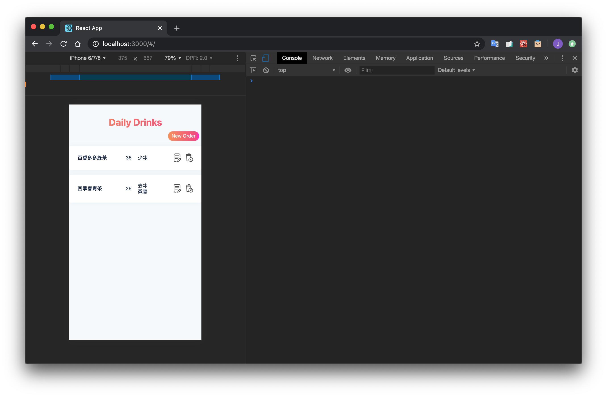
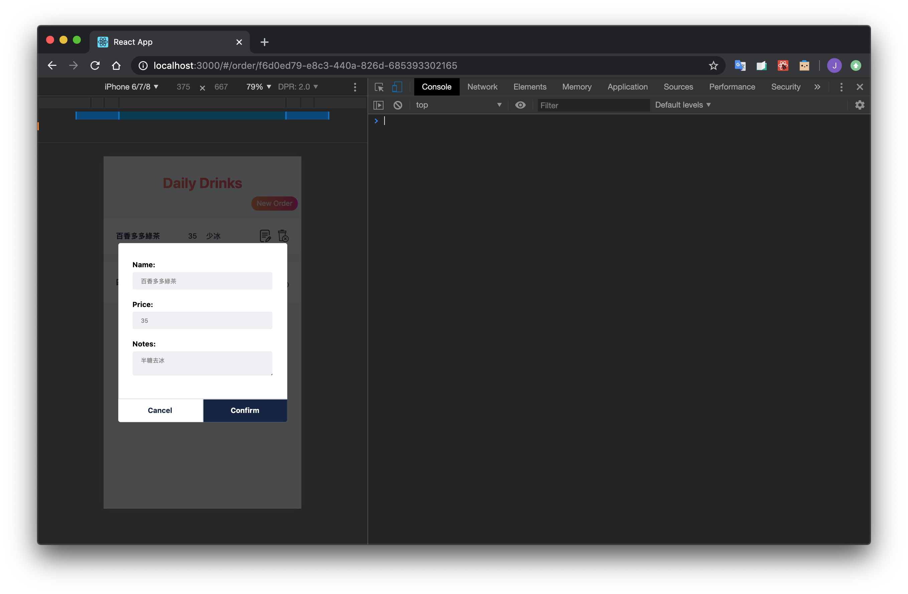

# Daily Drinks

17 Media pretest

Demo Link:

- GitHub Page: https://kerorojason.github.io/dailydrinks/#/
- CodeSandbox (testing unavailable): https://codesandbox.io/s/confident-microservice-b0ytx-b0ytx

Features:

- Context API
- react-router
- styled-components
- Unit testing and integration testing
- Responsive Web Design
- The Layout and Modal mainly refer to https://github.com/SaveYourTime/dailydrinks

