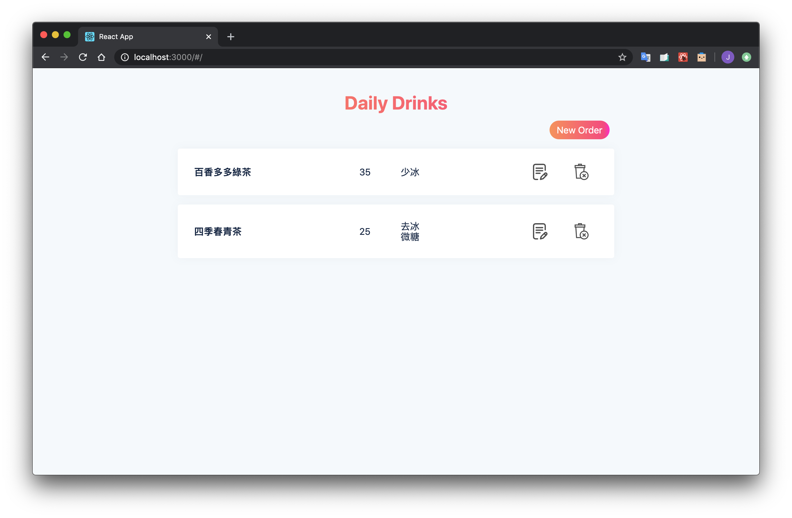
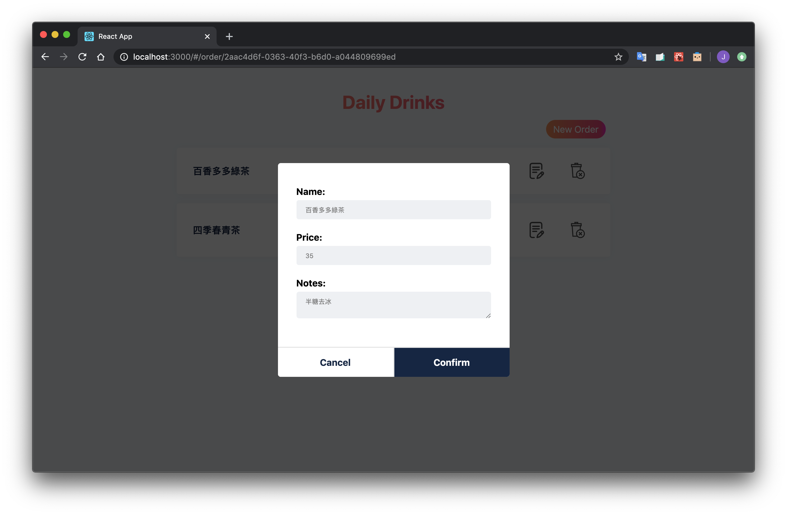
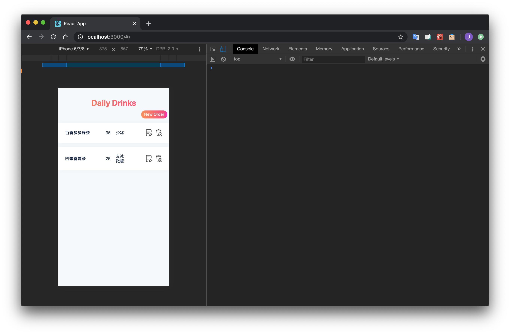
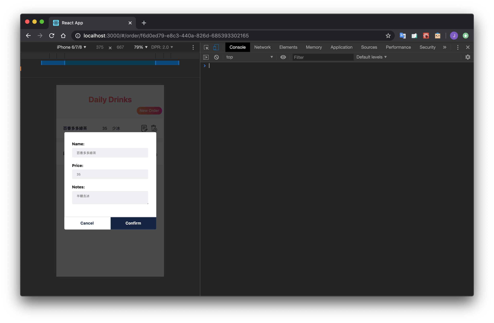

# Daily Drinks

17 media

Features:

- Context API
- react-router
- styled-components
- Unit testing and integration testing
- Responsive Web Design
- The Layout and Modal mainly refer to https://github.com/SaveYourTime/dailydrinks
